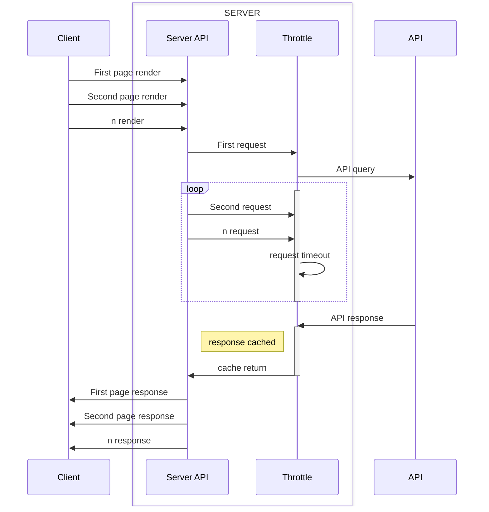

# PLANESPOTTING AT LAX

*photo: Frank Kovalchek https://www.flickr.com/photos/72213316@N00/52565495712*

## Welcome! 👋🏾

Thanks for checking out this repository.

[Planespotting at LAX](https://planespotting-lax.onrender.com/) is a website that I created to track inbound arrivals to Los Angeles International Airport. 

Partly as a hobby project, but mostly as a portfolio project.

## Table of contents

- [Version History](#version-history)
- [Insights](#insights)
  - [Built using](#built-using)
  - [What I learned](#what-i-learned)
  - [TODO list](#todo-list)
  - [Helpful resources](#helpful-resources)
- [Author](#author)

## Version History

### Mar 10, 2023. Version 0.0.1
* Created first iteration of the backend server.
* Hooked up AeroAPI from [flightaware.com](https://flightaware.com/commercial/aeroapi).
* Created /about page.
* Added node-cron for scheduled airframe data fetching.

### Mar 10, 2023. Version 0.0.2
* Connected API from [planespotters.net](https://www.planespotters.net/photo/api).
* Added front end production build to the backend.
* Added button linking to live flight tracking.

### Mar 10, 2023. Version 0.0.3
* Changed position of flight tracking button.
* Ammended data fields extracted from photos API.

### Mar 11, 2023. Version 1.0.0
* Website hosted on [render.com](https://render.com/).

### Mar 16, 2023. Version 2.0.0
* Added request throttling.
* Website now fetches data ON DEMAND. Cron scheduler no longer needed.
* Extracted `updateData` into separate function.
* Disabled airframe data fetching. 

### Mar 17, 2023. Verstion 2.0.1
* Added `unknownEndpoint` middleware: Now handled by `react-router` and no longer sends raw JSON error message.
* Fixed breaking bug with background image that crashed the website on load.

### Mar 17, 2023. Version 3.0.0
* Visual update to the front end UI.
* Added github and bmac buttons.
* Added README.md.

### Mar 21, 2023. Version 3.1.0
* Desktop UI overhaul. Card sizes are now consistent. 
* Added backdrop for smaller images.
* Added `back-to-top` button.
* Reduced server logging.

### Apr 2, 2023. Version 3.2.0
* Added weather section! 
* Added METAR section!
* chatGPT powered METAR decoder.
* Fixed a bug with multiple requests. Throttle now works ideally.

### Apr 23, 2023. Version 3.2.1
* Added hamburger menu bar. 
* Moved ATC comms buttons to menu drawer. 

## Insights

### Built using:
- [React](https://reactjs.org/) - JS UI framework.
- [Material UI](https://mui.com/) - React component library.
- `node.js` - Backend runtime.
- `express.js` - Backend server.
- `node-cron` - Function scheduler.
- `mongoDB` - Database.
- Mobile-first development mentality.

### What I learned:
First off, Material UI (MUI). This project was a dive off the deep end into the world of component libraries. 
Understanding how to read the component documentation and source code is a learned skill that will allow me to connect the underlying wires in larger codebases. Understanding how MUI overrides class based CSS was crucial. 

MUI components are like PC parts; you can copy the code but you still need to connect the wires and make it work in your specific system. Sometimes the parts fit neatly into a RAM slot, other times you have to read the specifications over and over to make sure you didn't get the wrong part for the job. 

Secondly, backend logic. Although my first love for web design is creating visually interesting front ends, problem solving is a very close second. 

Querying multiple API's, handling request failures, chaining them together using `async/await`, extracting useful information, optimising limited API request quotas and tying it all into a neat JSON file that can be served to clients was incredible. 

Making sure that changes that I make to the dataflow did not break something else in the process was a key concern. The last thing I wanted to do was break a part of the codebase that had already been tested and was in active use.

Writing react components was something I was already familiar with, so there was some comfort in the knowledge that if I got the backend working consistently and reliably, the front end state management would be easy. 

Thirdly, request throttling. This was the eureka moment that pleased me the most. Let me explain. 

When react is not running a production build (a.k.a still in the development build) components are mounted twice successively. It happens in an instant and is a feature built into react to catch bugs and side-effects during the render lifecycle. Particularly during component unmounting. 

This is not so great when you have a backend that is fetching data from a rate limited API. For example, on this website, aircraft photos are requested from `planespotters.net`. Lets say we request 15 different aircraft photos per page load. Now, because of `react.StrictMode` we are requesting twice that. If we are rendering 30 aircraft per page load, we request SIXTY photos in a span of seconds. 

This very quickly devolves into madness and any sane/rate-limited server will deny requests eventually. There is also the paranoia that I would be found guilty of DDOS'ing the server, which is a security risk for any public facing API.

The solution was to throttle requests. 

The first request to the server is processed immediately and a flag is set, indicating that data fetch is in progress. Any subsequent requests to the server are met with a timeout. When data is recieved from the API, it is processed into a clean JSON object and cached. 

The flag is then reset, signalling that data fetch is complete. The waiting requests are then served in the order they were received. 

Cached data is stored and served for 5 minutes, after which the next request kicks off a new fetch request. 

Since the data being sent is list of aircraft landing within the next hour, it doesn't change significantly in 5 minutes. This optimizes the speed with which incoming requests can be handled (caching) and reduces redundant calls (throttling).

## TODO list

* This website format could be expanded to include other airports in the future. 
* I have tried to include comments where necessary, that being said I am a huge fan of well commented code and there can always be more comments.
* Add premium features.
* Add user accounts and features.

## Author
My name is Sadiq! If you've read this far, I'm glad I've kept you interested. 

I'm always looking to learn more and if you're hiring for a Front End/Fullstack developer, who can add value to your team I would love to chat!

If you have ideas on how to improve the site drop me a message.
 
You can find me on [Linked-in](https://www.linkedin.com/in/sadiq-pasha/) or message me on [Discord](https://discordapp.com/users/452914925745209344). 

You can support my work [here](https://www.buymeacoffee.com/sadiqpasha).

Enjoy the website!